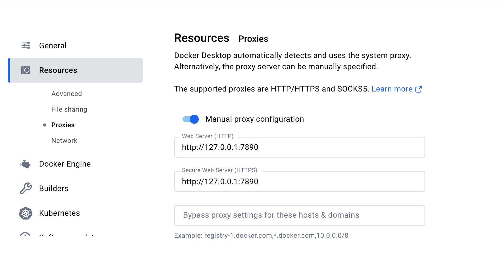

<h1 align="center">
  <br>DNMP 1.6<br>
</h1>

DNMP 可以构建出基于 Docker 的 PHP 开发环境，其优势有在短时间内随意构建不同版本的相关服务、环境统一分布在不同服务器等，使开发者能够更专注于开发业务本身。

> 友情提示：请务必配置 DockerHub 加速器（方法见底部），不然会镜像下载超时。

## 📖 产品特色

* 灵活切换适合国内的源（apt-get、php composer）
* 组件精简易懂，学习、测试环境、生产环境均适合
* 良好的扩展性

## 🚀 组件（容器）及相关软件版本

* Ningx：latest
* PHP56：php-fpm 5.6.x `composer:2.2.x swoole:1.10.5 redis:4.3.0`
* PHP72：php-fpm 7.2.x `composer:2.5.7 swoole:4.8.13 redis:5.3.7 mongodb:1.15.3`
* PHP74：php-fpm 7.4.x `composer:2.5.7 swoole:4.8.13 redis:5.3.7 mongodb:1.15.3`
* PHP80：php-fpm 8.0.x `composer:2.5.7 swoole:5.0.3 redis:6.1.0 mongodb:1.15.3`
* PHP81：php-fpm 8.1.x `composer:2.8.4 swoole:5.1.6 redis:6.1.0 mongodb:1.20.1`
* PHP82：php-fpm 8.2.x `composer:2.8.4 swoole:6.0.0 redis:6.1.0 mongodb:1.20.1`
* PHP83：php-fpm 8.3.x `composer:2.8.4 swoole:6.0.0 redis:6.1.0 mongodb:1.20.1`
* PHP84：php-fpm 8.4.x `composer:2.8.4 swoole:6.0.0 redis:6.1.0 mongodb:1.20.1`
* MySQL：5.7
* Redis：latest `默认密码：dnmp`
* Mogodb:  latest `默认验证数据库：admin 账号：admin 密码：admin`

### 目录结构

    dnmp
    |----/build                  镜像构建目录
    |----/config                 配置文件目录
    |----/data                   持久化数据目录
    |----/www                    WEB文件目录
    |----/.env-example           配置文件示例
    |----/docker-compose.yml     docker compose 配置文件（需本地编译）
    |----/docker-compose-hub.yml docker compose 配置文件（从Docker Hub拉取编译好的镜像）

## 🛠 开始安装

没有安装 Docker 的同学移步 [安装教程](https://github.com/telanflow/dnmp.git#安装-docker-及相关工具)，如果你有足够的时间强烈建议通读 [Docker — 从入门到实践](https://yeasy.gitbooks.io/docker_practice/content/)

    cd ~/
    git clone --depth 1 https://github.com/telanflow/dnmp.git
    
    cd dnmp
    cp .env-example .env
    
    # 配置数据库密码、时区、端口等
    vim .env

    # 基于Docker Hub已编译好的镜像启动容器
    sudo docker-compose -f docker-compose-hub.yml up -d
    
    # 本地构建全部镜像并启动容器
    sudo docker-compose up --build -d
    
    # 本地构建单个镜像并启动容器
    sudo docker-compose up --build -d [nginx|php56|php74|php80 ...]
    
    # 本地构建单个镜像
    sudo docker-compose build --no-cache [nginx|php56|php74|php80 ...]

> 📢 注意：dnmp部署完成后，需要修改redis服务的密码`config/redis/redis.conf 设置 requirepass dnmp（替换成你自己的密码）`

启动成功访问 http://localhost 即可

### 常用操作命令

    # 查看当前启动的容器
    sudo docker-compose ps
    
    # 启动部分服务在后边加服务名，不加表示启动所有，-d 表示在后台运行
    sudo docker-compose up -d [nginx|php56|php74|php80 ...]
    
    # 启动容器
    sudo docker-compose start [nginx|php56|php74|php80 ...]
    
    # 停止容器
    sudo docker-compose stop [nginx|php56|php74|php80 ...]
    
    # 重启容器
    sudo docker-compose restart [nginx|php56|php74|php80 ...]
    
    # 停止并删除相关的容器
    sudo docker-compose down [nginx|php56|php74|php80 ...]
    
    # 删除所有未运行的容器
    sudo docker rm $(sudo docker ps -a -q)
    
    # 删除所有未运行的镜像，-f 可以强制删除
    sudo docker rmi $(sudo docker images -q)
    
    # 删除dnmp
    sudo docker rm $(sudo docker ps -a | grep dnmp | awk '{print $1}')
    
    # ⚠️清理所有停止的容器（注意如果执行 docker images -a 会出现一些 none 的镜像，这些是构建镜像的中间层不占用空间也不是垃圾数据，不用管）
    sudo docker system prune
    
    # 进入容器
    docker exec -it [dnmp-nginx|dnmp-redis|dnmp-php74|dnmp-php80| ...] bash

更多可通过 `sudo docker -h` 或者 `sudo docker-compose -h` 查看

### 容器内目录映射

```
# Nginx
/etc/nginx          配置文件目录
/etc/nginx/html     .env文件中的 WWW_DIR

# PHP
/etc/nginx/html     .env文件中的 WWW_DIR
/usr/local/etc      配置文件目录 `部分文件已经映射到config目录下`

# Mysql
/etc/mysql           配置文件目录

# Redis
/usr/local/etc/redis 配置文件目录

```

### 修改镜像文件怎么处理？

比如在 php 里新增一个扩展

    # 1、更改对应的 dnmp/build/php/Dockerfile
    # 2、重新构建镜像
    sudo docker-compose build --no-cache [php56|php74|php80 ...]

### 如何在 php 里连接 MySQL 和 Redis？

    <?php
    
        echo "<pre>";
    
        // 连接 MySQL
        $user = "root";
        $pass = "root";
        $dbh = new PDO('mysql:host=mysql;dbname=mysql', $user, $pass);
        
        foreach($dbh->query('SELECT * from user') as $row) {
            print_r($row);
        }
    
        echo "<br />";
    
        // 连接 Redis
        $redis = new Redis();
        $redis->connect('redis', 6379);
        $redis->set("test-key","hello");
        echo "Stored string in redis:: " . $redis->get("test-key");
        
        // 连接 Mongodb
        $manager = new MongoDB\Driver\Manager("mongodb://mongodb:27017");
        

### 其他的坑

如果需要升级某些组件的版本需要注意载入对应版本的配置文件，修改对应的配置信息，比如 redis.conf 默认配置的出口 ip 为 127.0.0.1，这样的话 php 的容器是连不上的，需要修改成 0.0.0.0，另外也要注意修改对应的 log path。

## 安装 Docker 及相关工具

### 安装 docker（2选1）

1、参考 daocloud 提供的文档（推荐）

    # 注意按照文档如果执行类似 install docker-ce=17.03.1* 出错，执行 install docker-ce 即可
    https://download.daocloud.io/Docker_Mirror/Docker

2、ubuntu 系统（可能不是最新版本的，适合学习或者测试用）

    apt-get update && apt install docker.io    

### 安装 docker-compose

    sudo curl -L "https://github.com/docker/compose/releases/download/1.23.2/docker-compose-$(uname -s)-$(uname -m)" -o /usr/local/bin/docker-compose
    
    sudo chmod +x /usr/local/bin/docker-compose

### 启动 Docker

    sudo service docker start
    sudo docker info

### 配置 DockerHub 加速器（你用的阿里云也许不用配置，如果觉得下载镜像很慢就配置）

> ⚠️⚠️⚠️ 自 2024-06-06 开始，国内的 Docker Hub 镜像加速器相继停止服务，可选择为 Docker daemon 配置代理或自建镜像加速服务。
> 请使用最新的加速方法。

~~阿里云加速器：每个人有对应的加速地址，访问 https://cr.console.aliyun.com ->【镜像加速器】配置加速器~~

~~DaoCloud 加速器：http://guide.daocloud.io/dcs/daocloud-9153151.html~~

~~腾讯云加速器：https://www.qcloud.com/document/product/457/7207~~

#### 镜像加速

[Docker Hub 镜像加速器](https://gist.github.com/y0ngb1n/7e8f16af3242c7815e7ca2f0833d3ea6)

[2024-06-18 Docker Hub 镜像源列表](https://linux.do/t/topic/114516)

[2025-01-03 国内可用Docker镜像源加速器](https://www.wangdu.site/course/2109.html)

> Ubuntu 16.04+、Debian 8+、CentOS 7+

创建或修改 /etc/docker/daemon.json：

```bash
sudo mkdir -p /etc/docker
sudo tee /etc/docker/daemon.json <<EOF
{
    "registry-mirrors": [
        "https://docker.1panel.dev",
        "https://docker.foreverlink.love",
        "https://docker.xn--6oq72ry9d5zx.cn",
        "https://docker.zhai.cm",
        "https://docker.5z5f.com",
        "https://a.ussh.net",
        "https://docker.cloudlayer.icu",
        "https://hub.littlediary.cn",
        "https://hub.crdz.gq",
        "https://docker.unsee.tech",
        "https://docker.kejilion.pro",
        "https://registry.dockermirror.com",
        "https://hub.rat.dev",
        "https://dhub.kubesre.xyz",
        "https://docker.nastool.de",
        "https://docker.udayun.com",
        "https://docker.rainbond.cc",
        "https://docker.1panelproxy.com",
        "https://atomhub.openatom.cn",
        "https://docker.m.daocloud.io",
        "https://docker.1ms.run",
        "https://docker.linkedbus.com",
        "https://dytt.online",
        "https://func.ink",
        "https://lispy.org",
        "https://docker.xiaogenban1993.com"
    ]
}
EOF
sudo systemctl daemon-reload
sudo systemctl restart docker
```

### 配置Docker Desktop Proxies

如果不想配置加速器，可以直接使用代理方式。（该方式更快速有效，加速build时资源下载速度）




## 📄 License
[MIT License](/LICENSE)
